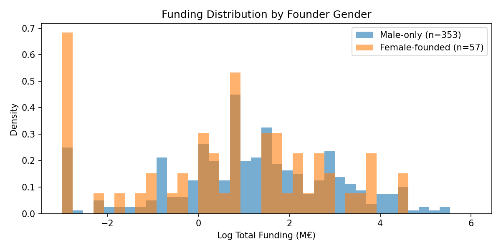

# Deep-Dive: Female Founder Effect on Total Funding

## 1. Descriptive Breakdown

**Sample with funding data:** N=420 (female-founded: 57, male-only: 353)

### Funding Metrics

| Metric | Female-Founded | Male-Only | Diff |
|--------|---------------|-----------|------|
| Total funding (M€) (median) | 2.30 | 3.00 | -0.70 |
| Total funding (M€) (mean) | 10.09 | 13.10 | -3.01 |
| Number of rounds (median) | 2.00 | 2.00 | +0.00 |
| Number of rounds (mean) | 2.37 | 2.68 | -0.31 |
| Time to 1st round (months) (median) | 20.00 | 20.00 | +0.00 |
| Time to 1st round (months) (mean) | 26.53 | 26.77 | -0.24 |

**Mann-Whitney U test** (total funding): U=9128, p=0.2614

### Sector Distribution

| Sector | Female % | Male % |
|--------|----------|--------|
| électronique | 7.0% | 11.9% |
| autres | 12.3% | 10.8% |
| numérique | 10.5% | 14.7% |
| santé | 64.9% | 45.6% |
| énergie | 3.5% | 12.2% |
| vide | 1.8% | 4.8% |

### Team & Education

| Variable | Female-Founded | Male-Only |
|----------|---------------|----------|
| Avg # founders | 1.98 | 1.62 |
| Has PhD (%) | 63.2% | 53.7% |
| Has MBA (%) | 26.3% | 27.8% |
| Serial founder (%) | 30.4% | 29.3% |

## 2. Interaction Effects

Testing whether the female founder effect varies across subgroups.

| Interaction Term | Coef | SE | p-value | Interpretation |
|-----------------|------|-----|---------|----------------|
| 5_has_female × 4_phd_founder | -0.242 | 0.705 | 0.731 |  |
| 5_has_female × 7_MBA | 0.288 | 0.616 | 0.640 |  |
| 5_has_female × 3_one_founder_serial | 0.740 | 0.628 | 0.238 |  |
| 5_has_female × founders_num | 0.010 | 0.425 | 0.982 |  |
| 5_has_female × santé | 0.029 | 0.672 | 0.965 |  |
| 5_has_female × numérique | -0.316 | 0.469 | 0.500 |  |
| 5_has_female × énergie | 1.251 | 1.581 | 0.429 |  |

## 3. Mediation Analysis (Baron & Kenny, 1986)

Testing whether sector clustering or team composition mediates the female founder effect.

**Step 1 — Total effect:** β=-0.4224, p=0.1717

**Step 2 — Female → Mediators (a-paths):**

| Mediator | Coef (a) | p-value |
|----------|----------|--------|
| santé_sector | 0.1930 | 0.0056 |
| founders_num | 0.3595 | 0.0029 |
| 4_phd_founder | 0.0943 | 0.1814 |
| 7_MBA | -0.0145 | 0.8220 |

**Step 3 — Direct effect controlling for mediators:**

Direct effect (c'): β=-0.6535, p=0.0400

**Indirect (mediated) effect:** 0.2311 (-54.7% of total effect)

→ Little evidence of mediation through these variables.

## 4. Propensity Score Matching

Matching female-founded startups to comparable male-only startups on observable characteristics (Rosenbaum & Rubin, 1983).

**Matched pairs:** 39 out of 40 treated units

**ATT (Average Treatment Effect on Treated):**
- Log scale: -1.3858
- Approx. euro difference: -9.30 M€
- t-test: t=-3.64, p=0.0005

### Covariate Balance (post-matching)

| Covariate | Treated Mean | Control Mean | Std. Diff |
|-----------|-------------|-------------|----------|
| founders_num | 1.949 | 1.923 | 0.032 |
| 4_phd_founder | 0.590 | 0.590 | 0.000 |
| 7_MBA | 0.282 | 0.282 | 0.000 |
| 3_one_founder_serial | 0.333 | 0.308 | 0.054 |
| 6_was_1_change_founders | 0.051 | 0.051 | 0.000 |
| sector_santé | 0.692 | 0.692 | 0.000 |
| sector_numérique | 0.051 | 0.077 | -0.103 |
| sector_énergie | 0.026 | 0.026 | 0.000 |
| sector_électronique | 0.103 | 0.103 | 0.000 |

## 5. Effect Size & Practical Significance

### Raw Funding Gap

- **Mean gap:** -3.01 M€ (female − male)
- **Median gap:** -0.70 M€
- Female median: 2.30 M€
- Male median: 3.00 M€

**Cohen's d:** -0.124 (negligible)

### Regression-Based Effect

- β (log scale): -0.7467, p=0.0385
- **Percentage change in funding:** -52.6%
- At median funding (3.00 M€), this translates to ~-1.58 M€

### Comparison with Other Predictors

| Predictor | β (log) | % Change | p-value |
|-----------|---------|----------|--------|
| 5_has_female | -0.7467 | -52.6% | 0.0385 |
| 7_MBA | 1.2368 | +244.5% | 0.0000 |
| 4_phd_founder | -0.0355 | -3.5% | 0.8632 |
| 3_one_founder_serial | -0.2604 | -22.9% | 0.2666 |
| 0_founders_number | 0.4204 | +52.3% | 0.0051 |
| 6_was_1_change_founders | 0.3431 | +40.9% | 0.3998 |

## 6. Academic Framing & Limitations

### Key Caveats

1. **Correlation ≠ Causation.** This is an observational study. The negative association
   between female founders and total funding does not imply that being female *causes*
   lower funding. Unobserved variables (investor networks, pitch quality, sector-specific
   dynamics, geographic concentration) may confound the relationship.

2. **Omitted Variable Bias.** Key variables that could explain the gap are missing from
   the dataset: investor characteristics, funding round details, company revenue/traction
   at time of fundraising, and founder network centrality.

3. **Sample Limitations.**
   - N is modest (especially female-founded startups with funding data: ~60-80)
   - French/European startup ecosystem may not generalize to other markets
   - Borderline significance (p≈0.04) means the finding is sensitive to specification
   - Multiple testing increases the risk of false positives

4. **Existing Literature.** The finding is consistent with a large body of research
   documenting gender gaps in venture funding (Brush et al., 2018; Kanze et al., 2018;
   Ewens & Townsend, 2020). However, the *mechanisms* differ across studies — some
   find demand-side differences (women seek less capital), others supply-side bias
   (investors fund women less for equivalent ventures).

5. **Mediation Evidence.** If the mediation analysis shows substantial indirect effects
   through sector clustering or team composition, this suggests the gap may reflect
   *sorting patterns* rather than direct discrimination — an important distinction for
   policy implications.

### Recommended Framing for the Thesis

> "We observe a negative association between female founder presence and total funding
> raised (β = [X], p = [Y]). However, this relationship is partially mediated by
> sector composition and team characteristics, suggesting that observable composition
> differences account for a meaningful portion of the gap. Given the borderline
> significance, modest sample size, and potential for omitted variable bias, we
> interpret this finding cautiously. It is consistent with the broader literature on
> gender disparities in startup funding, but our data do not allow us to distinguish
> between supply-side bias and demand-side selection effects."
