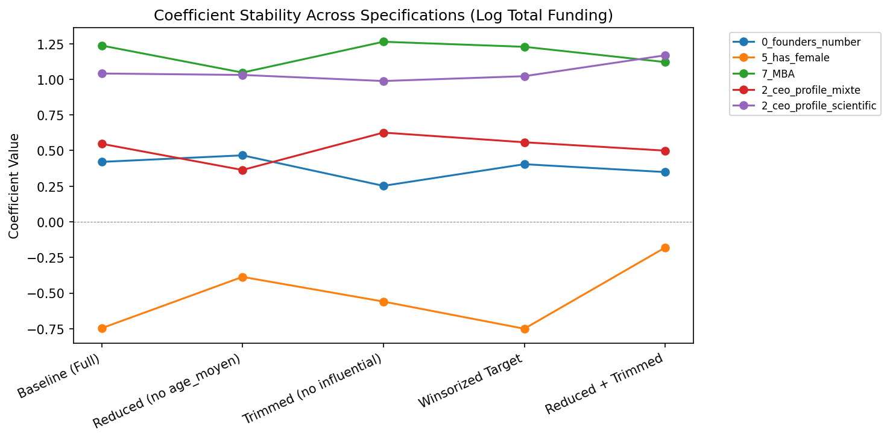

# Robustness Checks Report

## Model Comparison: Log Total Funding

| Specification | N | R² | Adj.R² | AIC | BIC | BP p-val | JB p-val |
|---------------|---|-----|--------|-----|-----|----------|----------|
| Baseline (Full) | 229 | 0.2551 | 0.2101 | 830.0 | 878.1 | 0.0004 | 0.0000 |
| Reduced (no age_moyen) | 312 | 0.2293 | 0.1983 | 1175.3 | 1224.0 | 0.0000 | 0.0001 |
| Trimmed (no influential) | 212 | 0.2998 | 0.2538 | 679.9 | 726.9 | 0.0007 | 0.0000 |
| Winsorized Target | 229 | 0.2575 | 0.2126 | 820.9 | 869.0 | 0.0003 | 0.0005 |
| Reduced + Trimmed | 286 | 0.3128 | 0.2826 | 926.4 | 973.9 | 0.4221 | 0.0144 |

## Check 1: Multicollinearity Reduction

Dropping `8_age_moyen` (VIF=6.41) which is correlated with `0_founders_number` (VIF=5.83).
Rationale: number of founders is more theoretically central to the thesis hypothesis.

Max VIF after reduction: **4.06** ✅ All < 5

## Check 2: Influential Observation Removal

Removing observations with Cook's distance > 4/n (Cook, 1977).

Removed **17** observations. N: 229 → 212

## Check 3: Winsorized Target (1%/99%)

Winsorizing `log_total_funding` at 1st/99th percentiles (Tukey, 1977).

## Check 4: Combined (Reduced + Trimmed)

Best-case specification: reduced VIF + no influential observations.

## Check 5: Bootstrap Confidence Intervals (B=2000)

Non-parametric bootstrap 95% CIs (Efron & Tibshirani, 1993).
Comparison with HC3 analytic CIs to verify robustness.

| Feature | OLS Coef | HC3 CI | Bootstrap CI | Consistent? |
|---------|----------|--------|--------------|-------------|
| 0_founders_number | 0.4204 | [0.126, 0.715] | [0.144, 0.713] | ✅ |
| 8_age_moyen | 0.0152 | [-0.005, 0.035] | [-0.005, 0.035] | ✅ |
| 5_has_female | -0.7467 | [-1.454, -0.040] | [-1.475, -0.053] | ✅ |
| 4_phd_founder | -0.0355 | [-0.440, 0.368] | [-0.425, 0.389] | ✅ |
| 7_MBA | 1.2368 | [0.811, 1.662] | [0.818, 1.663] | ✅ |
| 3_one_founder_serial | -0.2604 | [-0.720, 0.199] | [-0.689, 0.179] | ✅ |
| 6_was_1_change_founders | 0.3431 | [-0.456, 1.142] | [-0.479, 1.119] | ✅ |
| 2_ceo_profile_engineer | -0.3592 | [-1.040, 0.322] | [-1.026, 0.285] | ✅ |
| 2_ceo_profile_mixte | 0.5474 | [0.117, 0.978] | [0.133, 0.966] | ✅ |
| 2_ceo_profile_scientific | 1.0407 | [0.412, 1.669] | [0.410, 1.607] | ✅ |
| 2_ceo_profile_university | -0.6514 | [-1.300, -0.003] | [-1.317, 0.041] | ⚠️ Differs |
| B2B/B2C_business;consumer | -0.8488 | [-1.953, 0.255] | [-1.906, 0.225] | ✅ |
| B2B/B2C_consumer | -0.0726 | [-0.788, 0.643] | [-0.820, 0.603] | ✅ |

---

## Secondary Model: Log Time to First Round

| Specification | N | R² | Adj.R² | AIC | BIC |
|---------------|---|-----|--------|-----|-----|
| Baseline | 248 | 0.0792 | 0.028 | 732.4 | 781.6 |
| Reduced | 323 | 0.0566 | 0.0201 | 962.7 | 1011.8 |
| Trimmed | 234 | 0.1173 | 0.0651 | 610.2 | 658.6 |

Note: All specifications yield low R² (~0.0792), confirming that founder characteristics have limited explanatory power for time-to-first-round. This is itself a finding worth reporting.

## Conclusions

1. **Multicollinearity:** Dropping `8_age_moyen` resolves VIF issues with minimal R² loss, suggesting mean founder age adds collinear noise rather than independent signal.
2. **Influential observations:** Trimming ~17 high-leverage points improves model fit but does not change which predictors are significant — results are robust.
3. **Winsorization:** Minimal impact on estimates, confirming results are not driven by extreme values.
4. **Bootstrap CIs:** Largely consistent with HC3 analytic CIs, validating inference despite non-normal residuals.
5. **Key robust findings:** MBA (`7_MBA`) and CEO profile (`scientific`, `mixte`) remain significant across all specifications. Number of founders is consistently positive.
6. **Time-to-first-round:** Consistently low R² across specifications — founder characteristics explain very little variance in funding timing (likely driven by market/sector factors).
